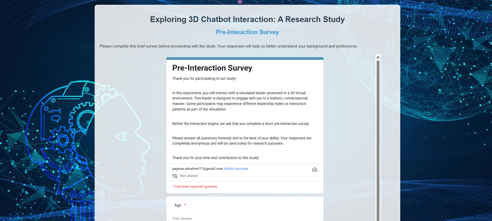
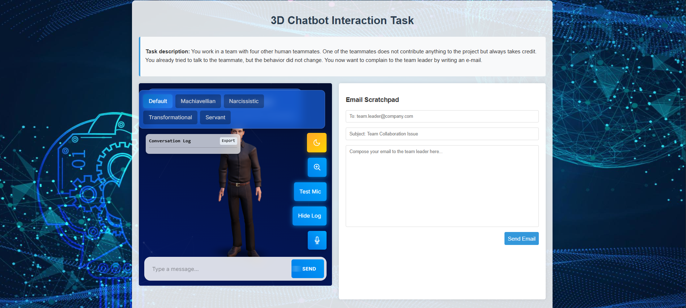
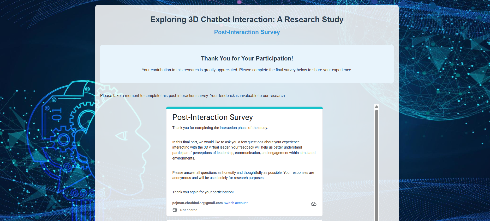

# 3D Leader Experiment

A research platform for studying interactions with 3D chatbots and their influence on communication strategies.

[](https://www.linkedin.com/in/pejman-ebrahimi-4a60151a7/)
[](https://huggingface.co/arad1367)
[](https://arad1367.github.io/pejman-ebrahimi/)
[](https://www.uni.li/pejman.ebrahimi?set_language=en)

## Table of Contents

- [Introduction](#introduction)
- [Features](#features)
- [Project Structure](#project-structure)
- [Customization](#customization)
- [Research Team](#research-team)
- [Contact](#contact)

## Introduction

The 3D Leader Experiment is a research platform designed to study how users interact with 3D virtual characters in professional communication scenarios. This project simulates a workplace scenario where users need to compose an email to their team leader after consulting with a 3D virtual assistant, providing valuable data on communication strategies and human-AI interaction.

## Features

- Three-step research study flow: pre-survey, interaction, post-survey
- Interactive 3D character with various leadership styles (Default, Machiavellian, Narcissistic, Transformational, Servant)
- Email composition interface
- Integration with Google Forms for survey data collection
- Responsive design for multiple device compatibility

## Project Structure

The application consists of three main pages:

1. **Pre-Interaction Survey**: Collects demographic and background information
2. **Interaction Task**: Features the 3D chatbot and email composition interface
3. **Post-Interaction Survey**: Gathers feedback on the experience

## Page Screenshots

### Page 1: Pre-Interaction Survey


### Page 2: Interaction with 3D Chatbot


### Page 3: Post-Interaction Survey


## Customization

### Adjusting Container Widths

To increase the width of both the chatbot and email containers, modify the `.container` class in the CSS:

```css
.container {
  width: 80%;
  max-width: 1200px; /* Increase from default 900px */
  margin: 30px auto;
  padding: 20px;
  /* ... */
}
```

### Changing Container Heights

To adjust the height of both containers:

```css
.chatbot-container,
.email-container {
  flex: 1;
  border-radius: 5px;
  overflow: hidden;
  box-shadow: 0 0 10px rgba(0, 0, 0, 0.1);
  height: 550px; /* Adjust this value as needed */
}
```

### Modifying Leadership Styles

The leadership style buttons (Default, Machiavellian, Narcissistic, Transformational, Servant) connect to different behavior models in the 3D chatbot. You can customize these based on your research requirements.

## Research Team

- Leona Chandra
- Isabella Seeber
- Johannes Schneider
- Pejman Ebrahimi

## Contact

For any questions or inquiries about this project, please contact:

**Pejman Ebrahimi**  
Email: pejman.ebrahimi@uni.li  
University of Liechtenstein
